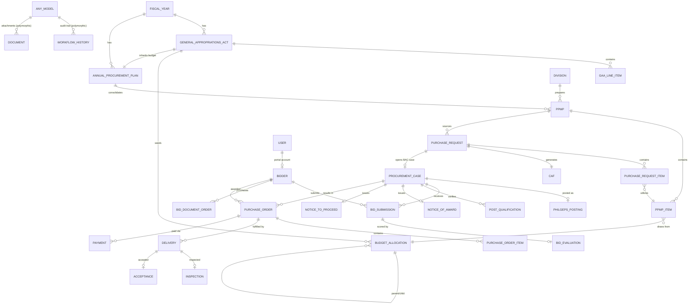

# System Architecture

## 1. Overview

The PMS Enterprise Procurement Management System implements the full Philippine
government procurement lifecycle mandated by **RA 12009** (New Government
Procurement Act), from the DBM General Appropriations Act (GAA) down to
payment, on a modern Laravel 12 / Livewire 3 / TailwindCSS 4 stack.

```
DBM GAA ─▶ Budget Allocation ─▶ APP ─▶ PPMP ─▶ Purchase Request ─▶ CAF
   ─▶ BAC Procurement ─▶ PhilGEPS Posting ─▶ Bidder Portal ─▶ Bidding
   ─▶ Award ─▶ Notice to Proceed ─▶ Purchase Order ─▶ Delivery
   ─▶ Inspection ─▶ Acceptance ─▶ Payment ─▶ Reports & Analytics
```

Every phase change is written through a single choke point
(`App\Models\Concerns\HasWorkflow::transitionTo()`), which validates the
transition against the enum's `allowedTransitions()` and appends an immutable
row to `workflow_histories` (polymorphic, `workflowable_type` / `workflowable_id`).
Combined with `spatie/laravel-activitylog` (field-level before/after diffs on
every auditable model) this gives the system a complete, tamper-evident audit
trail without any bespoke logging code scattered across controllers.

## 2. Layered design

| Layer | Responsibility | Examples |
|---|---|---|
| **Livewire Components** (`app/Livewire/**`) | UI state, validation, calls into Services. No business rules live here. | `PurchaseOrder\PurchaseOrderShow`, `Settings\Index` |
| **Form Requests / Livewire `rules()`** | Input validation | per-component `rules()` |
| **Policies / Gates** (`app/Policies/**`) | Authorization, backed by Spatie Permission | `PpmpPolicy`, `GaaPolicy` |
| **Services** (`app/Services/**`) | Business rules, transactions, workflow transitions, event dispatch | `PpmpService`, `BudgetAllocationService` |
| **Repositories** (`app/Repositories/**`) | Query abstraction for a handful of high-traffic aggregates (e.g. GAA) | `GaaRepositoryInterface` |
| **Events / Listeners** (`app/Events`, `app/Listeners`) | Decouple side effects (notifications, auto-generation) from the triggering action | `PurchaseRequestApproved` → `GenerateCertificateOfAvailabilityOfFunds` |
| **Notifications** (`app/Notifications/**`) | Mail (and SMS-ready) alerts | `NoticeOfAwardIssuedNotification` |
| **Models** (`app/Models/**`) | Eloquent, UUID PKs, casts to backed enums | see ERD below |

### Why Services + Events instead of "fat controllers"

Every workflow-changing action (approve a PPMP, approve a GAA, issue a Notice
of Award, record a payment) is expressed as one method on a Service class
that: (1) validates business rules, (2) wraps multi-table writes in
`DB::transaction()`, (3) calls `transitionTo()` for the audit trail, and
(4) dispatches a domain Event. Livewire components and the JSON API controllers
are both thin adapters over the same Services, so the two front doors can
never drift in behavior.

## 3. Entity-Relationship Diagram (core lifecycle)



> The full physical schema (43 migrations) is in `database/migrations/`;
> every table uses a UUID primary key (`HasUuid` trait) and
> `created_at`/`updated_at` timestamps.

## 4. Workflow state machines

Each phase's states are modeled as a PHP backed `enum` implementing
`App\Support\Workflow\Transitionable`, so the *complete* set of legal
transitions is declared in one place per phase and enforced by
`HasWorkflow::transitionTo()`:

| Phase | Enum | States |
|---|---|---|
| 1. GAA | `GaaStatus` | Draft → Validated → Approved → Distributed |
| 2. APP | `AnnualProcurementPlanStatus` | Draft → For Consolidation → BAC Review → Approved → Locked |
| 4. PPMP | `PpmpStatus` | Draft → Division Chief Review → Planning Review → Budget Validation → BAC Consolidation → Approved → Locked (+ Returned for Revision) |
| 5. Purchase Request | `PurchaseRequestStatus` | Draft → Division Chief → Planning → Budget → Approved (HOPE) (+ Rejected/Cancelled) |
| 6. CAF | `CafStatus` | Generated → Certified → Approved → Printed |
| 7-17. BAC Case | `ProcurementCaseStatus` | Planning → Posted → Bidding → Evaluation → Post-Qualification → Awarded → NTP Issued → PO Issued → Completed (+ Cancelled) |
| 8. PhilGEPS Posting | `PhilgepsPostingStatus` | Published → Closed / Cancelled |
| 15. Notice of Award | `NoticeOfAwardStatus` | Awarded → Accepted / Declined |
| 17. Purchase Order | `PurchaseOrderStatus` | Draft → Approved → Delivered → Inspected → Accepted → Invoiced → Paid (+ Cancelled) |

## 5. Sequence diagram: Purchase Request → CAF (event-driven)

```mermaid
sequenceDiagram
    actor EndUser
    actor DivisionChief
    actor Planning
    actor Budget
    actor HOPE
    participant PRService as PurchaseRequestService
    participant Event as PurchaseRequestApproved
    participant Listener as GenerateCertificateOfAvailabilityOfFunds
    participant CafService

    EndUser->>PRService: addItem() / submit()
    PRService-->>DivisionChief: status = Division Chief
    DivisionChief->>PRService: divisionChiefApprove()
    PRService-->>Planning: status = Planning
    Planning->>PRService: planningApprove()
    PRService-->>Budget: status = Budget
    Budget->>PRService: budgetApprove()
    PRService-->>HOPE: status = HOPE
    HOPE->>PRService: hopeApprove()
    PRService->>PRService: utilize PPMP item balances (DB transaction)
    PRService->>Event: dispatch(pr)
    Event->>Listener: handle(event) [queued]
    Listener->>CafService: generate(pr)
    CafService-->>Listener: CAF (status: Generated)
